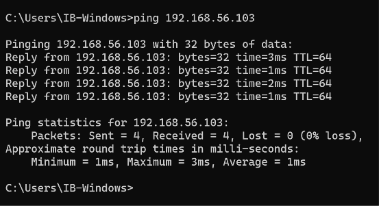
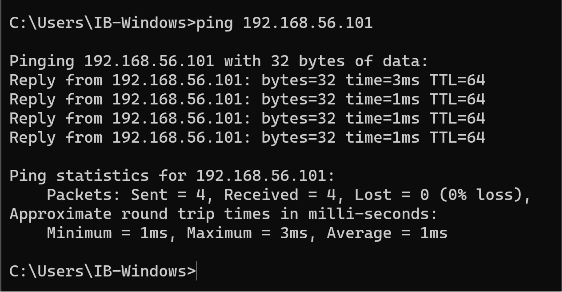
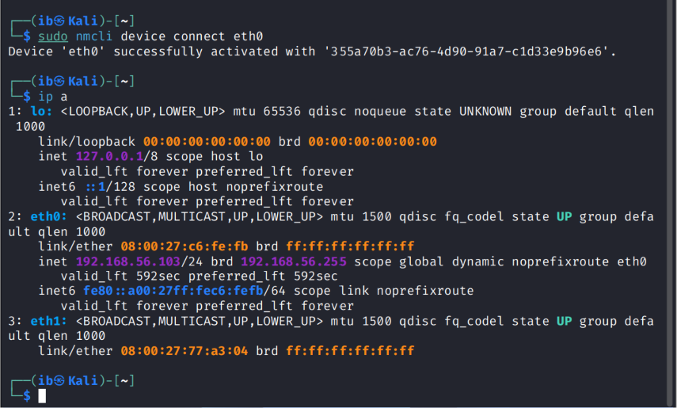

# Phase 2 — Networking

## Objective
Get all three VMs (Windows 11, Ubuntu, Kali Linux) onto an isolated virtual network so they could communicate with each other, laying the groundwork for a Domain Controller to be added later.

## Environment / Setup
- **Hypervisor:** Oracle VirtualBox
- **Target network type:** Host-Only Adapter (isolated network, not exposed to the internet or the physical LAN)
- **VMs involved:** Windows 11, Ubuntu, Kali Linux

## Steps Taken
1. Opened each VM's network settings expecting to see NAT, Bridged Adapter, and Host-Only Adapter as options.
2. Investigated why the Host-Only Adapter option wasn't appearing in the VirtualBox GUI, checking VirtualBox version, Windows Network Connections, the VirtualBox Host-Only Ethernet Adapter, DHCP configuration, and the VirtualBox NDIS6 Bridge Driver.
3. Discovered that Windows already had a "VirtualBox Host-Only Ethernet Adapter" installed and functioning — the GUI simply wasn't surfacing it as a selectable option.
4. Used `VBoxManage` from the command line to manually assign each VM's network adapter to the Host-Only network:
   ```
   VBoxManage modifyvm "Windows11" --nic1 hostonly --hostonlyadapter1 "VirtualBox Host-Only Ethernet Adapter"
   ```
   Repeated the same command for Ubuntu and Kali, substituting the VM name.
5. Verified each VM received an IP address on the Host-Only network:
   - Windows 11 — `192.168.56.102`
   - Ubuntu — `192.168.56.101`
   - Kali — `192.168.56.103`
6. Tested connectivity from Windows 11 with `ping 192.168.56.101` (Ubuntu) and `ping 192.168.56.103` (Kali) — both replied successfully.





## Problems and Solutions

**Problem:** VirtualBox's network adapter settings only showed NAT and Bridged Adapter as options. No Host-Only Adapter was available to select, even though Host-Only networking is a standard VirtualBox feature.

**Solution:** The Host-Only adapter driver was already installed correctly on the host machine — this was confirmed by finding it listed in Windows Network Connections. The issue was isolated to the VirtualBox GUI not displaying it as selectable. Bypassing the GUI entirely and using `VBoxManage` (VirtualBox's command-line management tool) to directly assign the adapter resolved it immediately, for all three VMs.

**Problem:** After a later reboot, pinging Kali from Windows 11 started returning "Request timed out" instead of a reply. Running `ip a` on Kali showed its Host-Only interface (`eth0`) was up but had no IPv4 address assigned — it had simply failed to renew its DHCP lease after the restart.

**Solution:** Kali's newer release doesn't ship the traditional `dhclient` tool, so a modern equivalent was used instead to force the interface to request a new lease:
```
sudo nmcli device connect eth0
```
This immediately brought `eth0` back up with its expected address (`192.168.56.103`), and connectivity from Windows 11 was restored.



