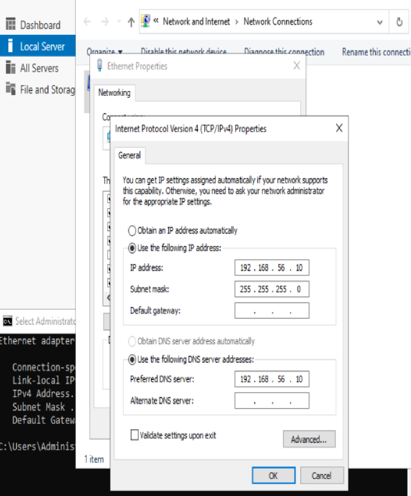
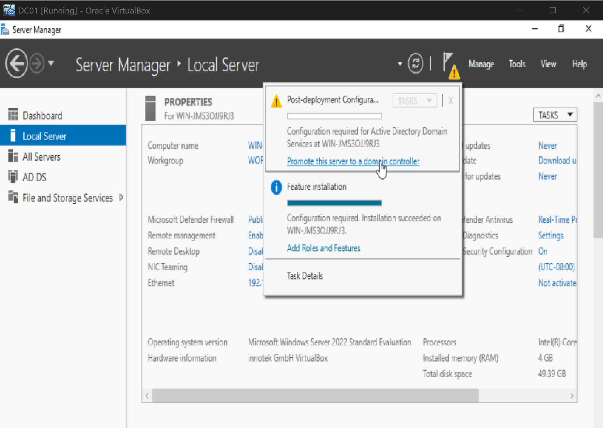
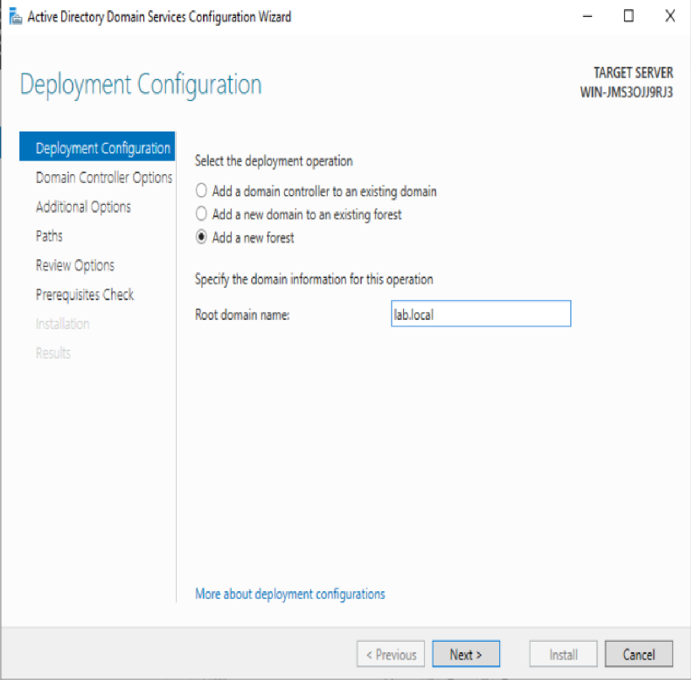
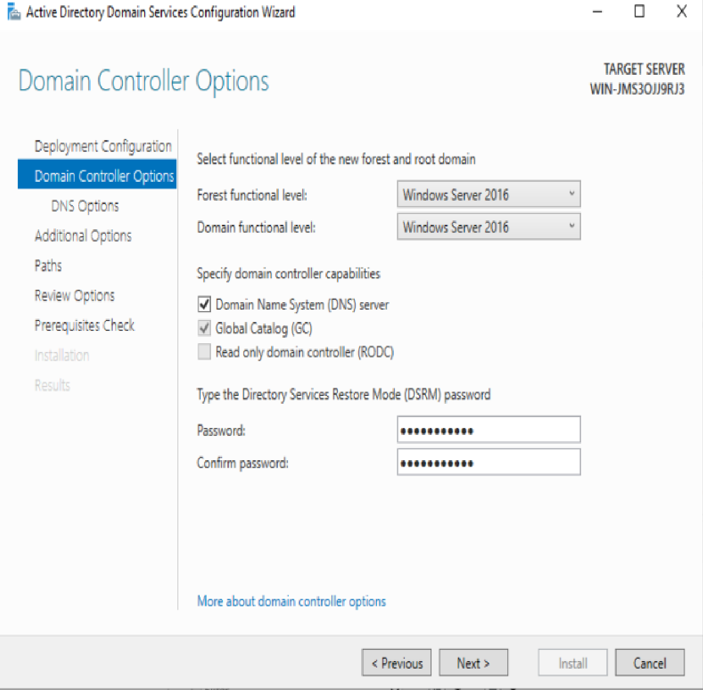
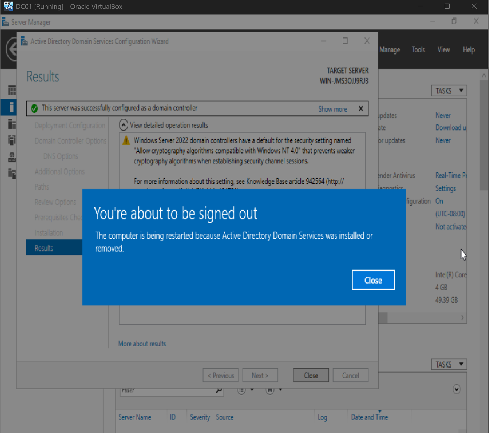
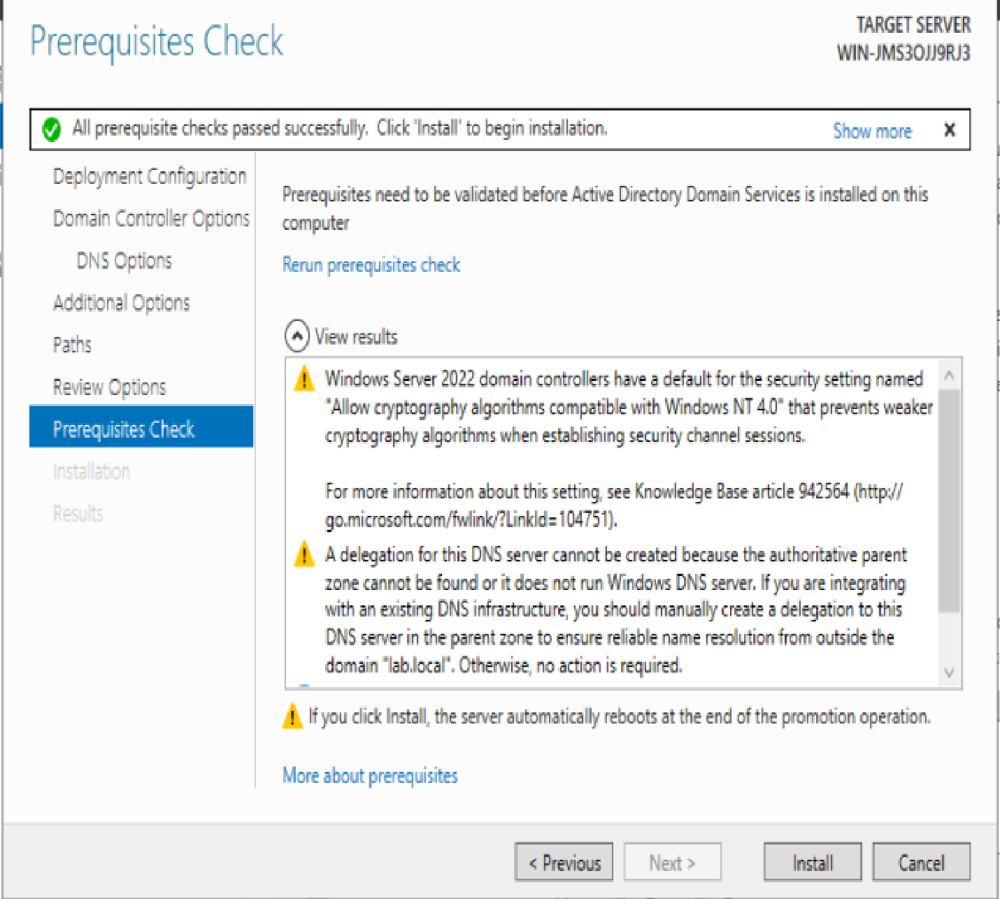

# Phase 3 — Domain Controller

## Objective
Deploy a Windows Server 2022 virtual machine, configure it with a static IP, install the Active Directory Domain Services (AD DS) role, and promote it to the first Domain Controller of a new Active Directory forest.

## Environment / Setup
- **VM name:** DC01
- **OS:** Windows Server 2022 Standard Evaluation (Desktop Experience)
- **Allocated resources:** 4 GB RAM, 2 CPU cores, 50 GB virtual disk (later increased to 6144 MB RAM as the lab grew)
- **Network:** Host-Only Adapter (same isolated network from Phase 2)
- **Static IP:** `192.168.56.10`
- **Subnet mask:** `255.255.255.0`
- **Default gateway:** blank (no gateway needed on an isolated Host-Only network)
- **Preferred DNS:** `192.168.56.10` (points to itself, since the DC will also serve as the DNS server)
- **Domain created:** `lab.local`
- **Forest/Domain Functional Level:** Windows Server 2016

## Steps Taken
1. Downloaded the official Windows Server 2022 evaluation ISO from Microsoft.
2. Created a new VM named `DC01` and attached the ISO.
3. Installed Windows Server 2022 Standard Evaluation (Desktop Experience, not Server Core) and set the local Administrator password.
4. Before installing any roles, manually configured networking:
   - Static IP `192.168.56.10`
   - Subnet mask `255.255.255.0`
   - Default gateway left blank
   - Preferred DNS pointed to itself (`192.168.56.10`)

5. In Server Manager, went to **Manage > Add Roles and Features** and installed **Active Directory Domain Services (AD DS)** only — no other roles.
6. After the role finished installing, clicked **Promote this server to a domain controller**.

7. Selected **Add a new forest** and created the domain `lab.local`.

8. Set both the Forest and Domain Functional Level to **Windows Server 2016** (the most current functional level available, even on Server 2022 — functional levels lag behind OS releases and 2016 remains the ceiling).

9. Received a DNS delegation warning during the prerequisite check.
10. Prerequisite checks passed, the configuration installed, and the server rebooted automatically.
11. Confirmed the final message: *"This server was successfully configured as a domain controller."*

## Problems and Solutions

**Problem:** During promotion, the wizard displayed the warning: *"A delegation for this DNS server cannot be created..."*

**Solution:** This warning is expected and harmless for a brand-new, isolated lab forest. DNS delegation normally lets a parent DNS zone forward requests for a subdomain to a child DNS server — but since `lab.local` isn't a subdomain of any real parent zone (it's the root of its own private forest with no external DNS infrastructure to delegate from), there's nothing to delegate. Microsoft's promotion wizard raises this warning by default any time it can't find a parent zone to configure delegation in, even when none is needed. It was safely ignored and did not affect the promotion.
