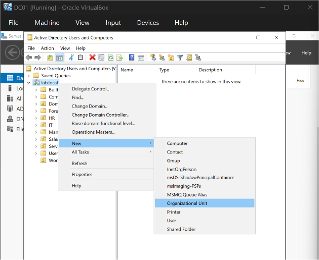
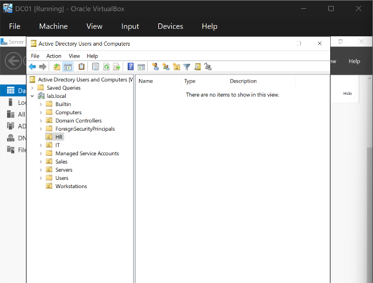

# Phase 4 — OU Structure

## Objective
Verify that DC01 was fully healthy after promotion, then build out the Organizational Unit (OU) structure that the rest of the domain's users, computers, and groups would be organized into.

## Environment / Setup
- **DC:** DC01 (`lab.local`)
- **Tool used:** `dcdiag` (built-in Active Directory diagnostic utility), Active Directory Users and Computers (ADUC)
- **OU design:** flat structure — `IT`, `HR`, `Sales`, `Workstations`, `Servers` — sitting directly under the domain root, rather than nested under a top-level container. Chosen for simplicity at this lab's scale; users live directly in their department OU, and computer objects are intended to move into `Workstations` or `Servers` after being domain-joined.

## Steps Taken
1. Ran `dcdiag` on DC01 to confirm the Domain Controller was healthy after promotion. Nearly every test passed cleanly on the first run (Connectivity, Advertising, ForestDnsZones, DomainDnsZones, Schema, Configuration, LocatorCheck, Intersite, and more).
2. One test failed on the first pass: **DFSREvent**, which warned that SYSVOL replication issues could cause Group Policy problems. This was investigated and resolved (see Problems and Solutions below).
3. Also reviewed Server Manager's flagged Events and Services alerts, which turned out to be unrelated to AD health (see Problems and Solutions).
4. Once DC01 was confirmed fully healthy, opened **Active Directory Users and Computers** (`dsa.msc`) and created five Organizational Units directly under `lab.local`, using **right-click on `lab.local` > New > Organizational Unit** for each one:
   - `IT`
   - `HR`
   - `Sales`
   - `Workstations`
   - `Servers`

5. Left **"Protect container from accidental deletion"** checked on each OU (the default), which prevents accidental deletion until explicitly unchecked later.

## Problems and Solutions

**Problem:** On the first `dcdiag` run, the `DFSREvent` test failed with the warning *"There are warning or error events within the last 24 hours after the SYSVOL has been shared. Failing SYSVOL replication problems may cause Group Policy problems."*

**Solution:** On a single-DC forest, this is commonly just a timing issue — DFSR (the service that replicates SYSVOL) needs a short window after promotion to finish its initial sync before SYSVOL is marked ready, and `dcdiag` can catch it mid-transition. Re-running `dcdiag /test:dfsrevent` shortly afterward showed the test passing cleanly, and `net share` confirmed both `SYSVOL` and `NETLOGON` were properly shared. No further action was needed.

**Problem:** Server Manager's dashboard repeatedly flagged **Events** and **Services** in red on the Local Server / All Servers tiles.

**Solution:** Investigating each flagged item showed they were unrelated to Active Directory health:
- The flagged **Service** was the Microsoft Edge Update Service sitting in a "Stopped" state — a normal, background browser-update service with no connection to AD, DNS, or domain functionality.
- The flagged **Events** were repeated **Kernel-Power Event ID 41** entries, which Windows logs any time a machine restarts without a clean shutdown sequence. In this VirtualBox lab, these accumulated from resetting or powering off VMs directly through VirtualBox's controls rather than shutting down from inside the guest OS. Going forward, shutting down VMs from **Start > Power > Shut down** inside the guest avoids generating new ones. The existing entries were historical noise and required no fix.

**General note on `dcdiag`'s SystemLog test:** this particular test flags as "failed" any time it finds *any* error/warning event in the System log over the last 24 hours, regardless of severity or relevance to AD — meaning it's expected to show non-critical noise (COM permission warnings, disk write-cache driver messages, the Kernel-Power events above) even on a perfectly healthy DC. It's worth treating this test's output as informational rather than a strict pass/fail signal.