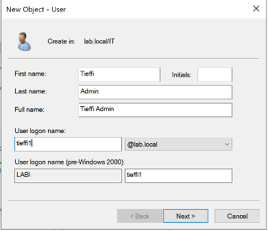
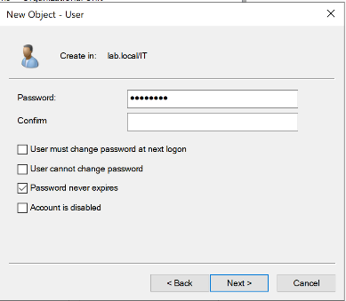
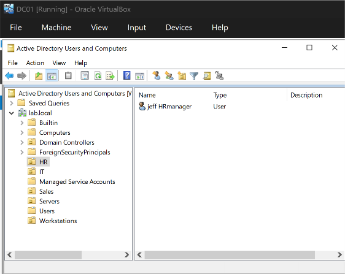
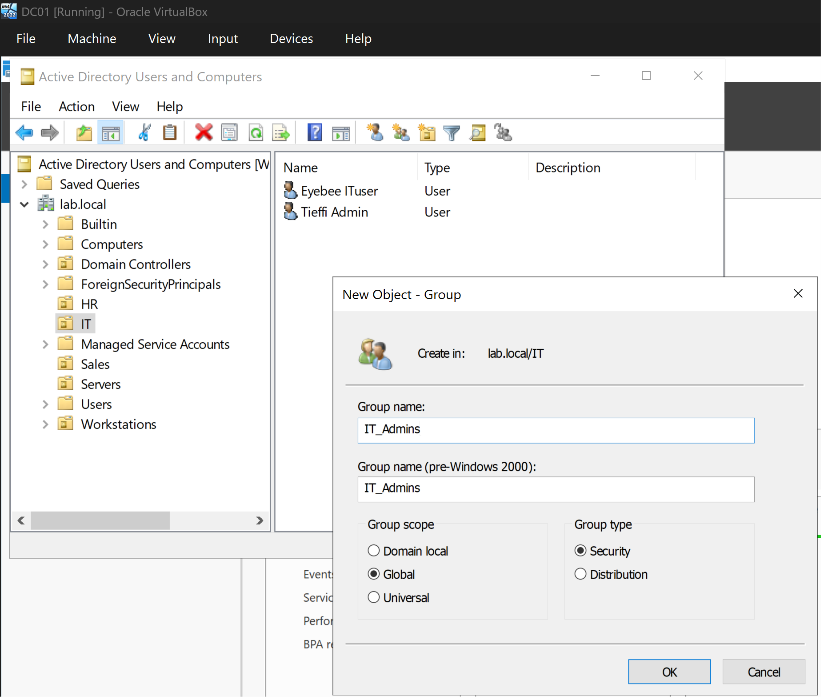
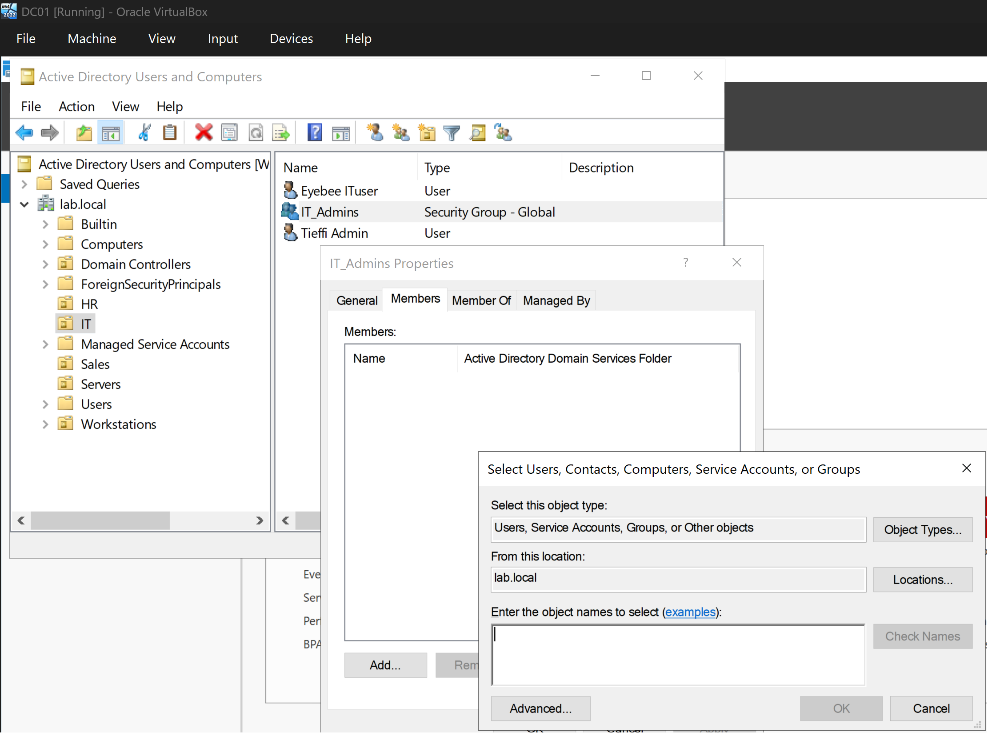
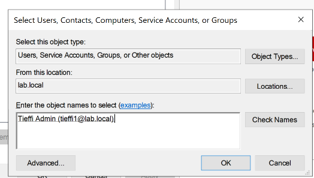
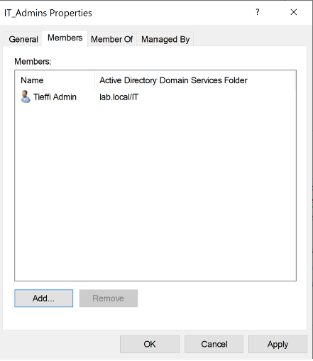

# Phase 5 — Users and Groups

## Objective
Create domain user accounts across each department OU, then build security groups to manage permissions and access separately from the OU structure.

## Environment / Setup
- **DC:** DC01 (`lab.local`)
- **Tool used:** Active Directory Users and Computers (ADUC)
- **Users created:**
  - `IT` OU — Eyebee ITuser, Tieffi Admin
  - `HR` OU — jeff HRmanager
  - `Sales` OU — Kevin Sales, Teddy Sales
- **Groups created (Global, Security scope):**
  - `IT_Admins` (in `IT` OU) — member: Tieffi Admin
  - `HelpDesk` (in `IT` OU) — member: Eyebee ITuser
  - `HR` (in `HR` OU) — member: jeff HRmanager
  - `Sales` (in `Sales` OU) — members: Kevin Sales, Teddy Sales

## Steps Taken

### User Creation
1. In ADUC, right-clicked each target OU > **New > User** and stepped through the wizard for each of the five users listed above — entering first/last name and logon name:

2. ...then setting the password and account options (password expiration, "must change at next logon," etc.):

3. Users were created one at a time through the GUI rather than scripted, specifically to build familiarity with the account-creation wizard and its options before automating the process later with PowerShell.

### Security Group Creation
4. Right-clicked each department OU > **New > Group**, setting **Group scope** to **Global** and **Group type** to **Security** for each one:

5. Opened each new group's **Properties > Members > Add**, and selected the target user from the object picker:

6. Clicked **Check Names** to confirm it resolved to the correct account:

7. Confirmed the user now appeared as a member of the group:

## Problems and Solutions

**Problem:** One user account (Teddy Sales) showed a downward-arrow icon badge in ADUC after creation, indicating the account was disabled.

**Solution:** This is ADUC's standard visual indicator for a disabled account — it can happen if the "Account is disabled" checkbox gets set during the creation wizard, whether intentionally or by accident. Disabling an account doesn't affect its group memberships, so it was safe to simply right-click the account and select **Enable Account** afterward, with no other cleanup required.

## Key Concept: OUs vs. Security Groups

A quick note on why both exist, since they can look similar in ADUC at first glance:

- **OUs** organize objects by structure and are the mechanism Group Policy Objects (GPOs) link to — an object lives in exactly one OU at a time, like a folder.
- **Security groups** organize objects by access/permissions — a single user can belong to many groups simultaneously, and group membership is unrelated to which OU a user sits in. Placing a user in the `IT` OU does not automatically add them to any `IT`-related group; group membership has to be assigned explicitly.
