# Phase 6 — Joining Windows 11 Client to the Domain

## Objective
Join the Windows 11 VM to the `lab.local` domain, verify successful authentication for both an administrator account and a standard user account, and confirm the resulting computer object is correctly organized within the AD OU structure.

## Environment / Setup
- **Windows11 VM:** dual-adapter (NAT + Host-Only), previously running under a local account (`IB-Windows`)
- **DC01:** Windows Server 2022, domain controller for `lab.local`, static IP `192.168.56.10`
- **Domain admin account used:** `tieffi1` (display name: Tieffi Admin)
- **Standard user account used for testing:** Eyebee ITuser

## Steps Taken
1. Checked Windows11's current network configuration with `ipconfig /all`. The Host-Only adapter (`192.168.56.x`) had no DNS server configured — only the NAT adapter showed DNS servers, and those were ISP-assigned, irrelevant to the domain.

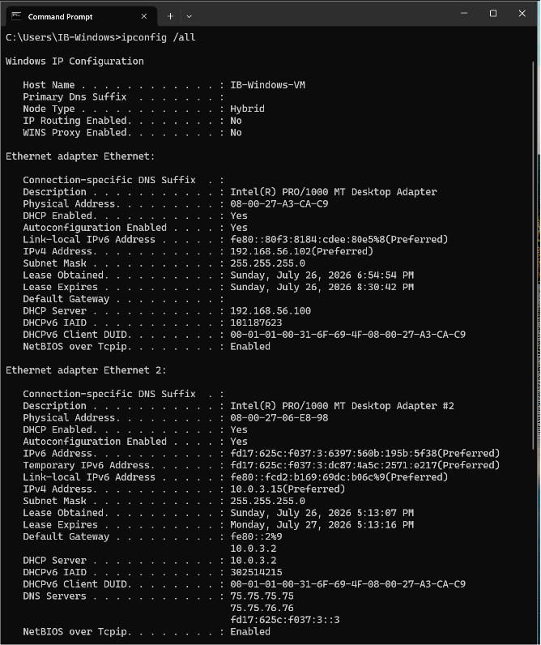

2. Confirmed the two visible network profiles in Settings and Control Panel corresponded to the two adapters — "Network 2" (Connected, internet) was the NAT adapter, and "Unidentified network" (no internet) was the Host-Only adapter, which is expected for an isolated lab segment.

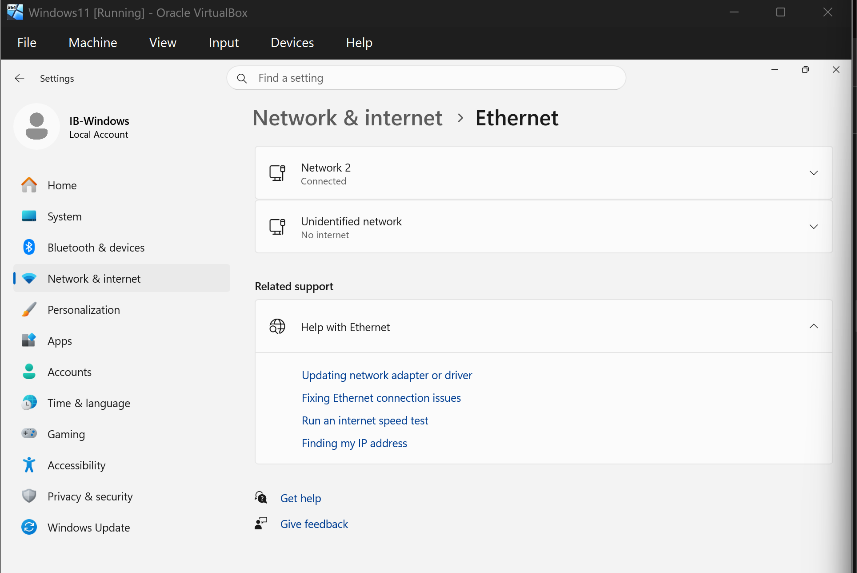
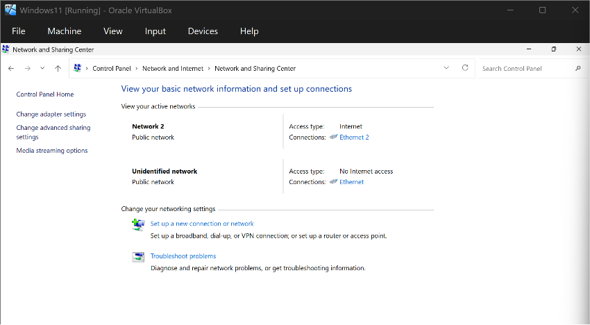

3. Manually set the Host-Only adapter's DNS server to `192.168.56.10` (DC01) via Settings > Network & Internet > Ethernet > Edit DNS settings > Manual > Preferred DNS.

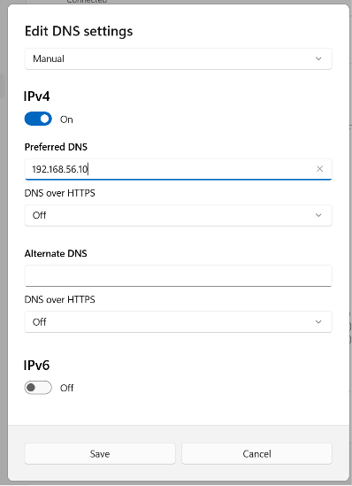
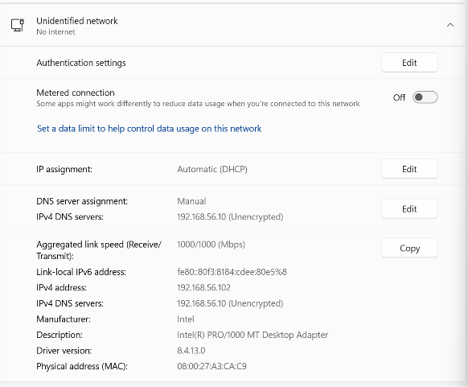

4. Verified the fix with `ipconfig /all` (confirmed `DNS Servers: 192.168.56.10` on the Host-Only adapter) and `nslookup lab.local` (confirmed resolution to `192.168.56.10`).

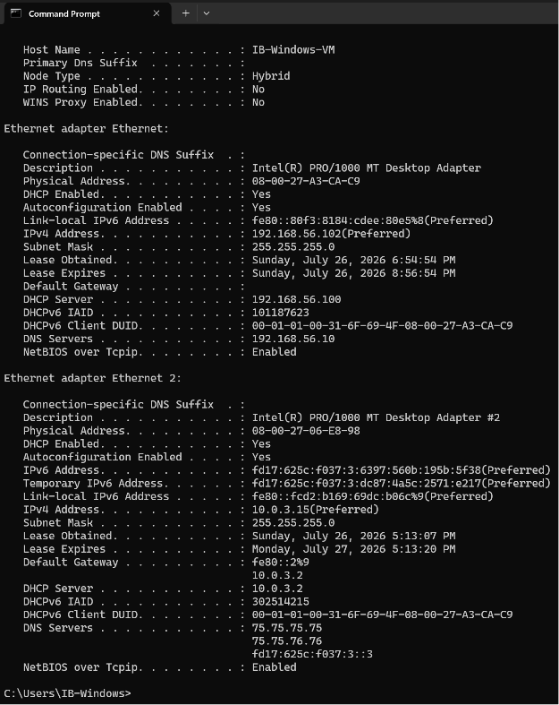
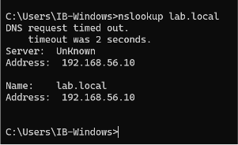

5. Attempted the domain join via System Properties > Change > Member of: Domain > `lab.local`. First attempt failed with *"An Active Directory Domain Controller (AD DC) for the domain 'lab.local' could not be contacted"* — DC01 was powered off at the time.

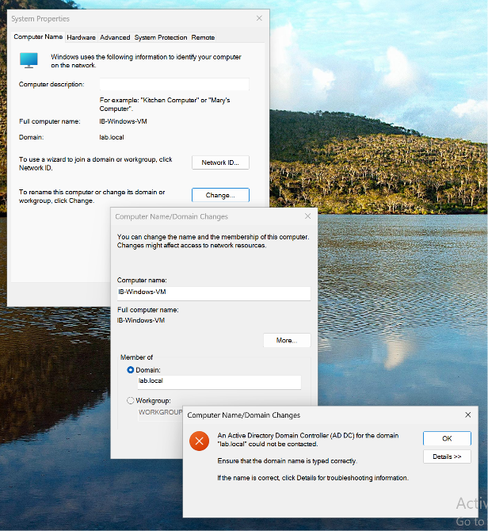

6. Powered on DC01, waited for services to fully start, and retried the join. Prompted for domain credentials; authenticated with `tieffi1`.
7. Received the "Welcome to the lab.local domain" confirmation and restarted the VM as prompted.

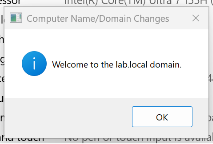

8. Logged in post-restart using the domain account (`lab\tieffi1`). Verified with `whoami`, which returned `lab\tieffi1`.

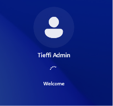
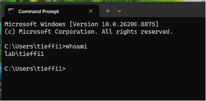

9. Confirmed the computer object landed in Active Directory: `IB-WINDOWS-VM` appeared in the default `Computers` container in ADUC.

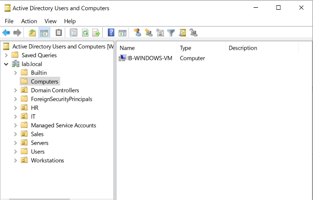

10. Moved the `IB-WINDOWS-VM` computer object from the default `Computers` container into the `Workstations` OU to match the intended OU structure.

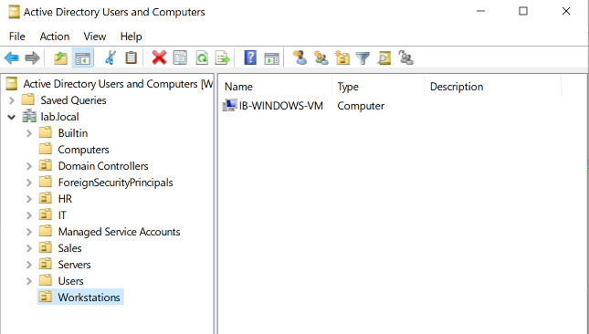

11. Tested domain authentication for a standard user by logging in as `Eyebee ITuser`. This triggered a forced password change (default "User must change password at next logon" policy on new AD accounts) — completed the change and logged in successfully, confirming domain auth works for non-admin accounts.

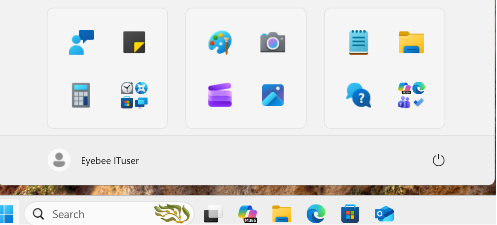

## Problems and Solutions

**Problem:** Domain join failed with *"AD DC could not be contacted."*
**Solution:** DC01 was powered off, so there was no domain controller available to authenticate the join. Powered on DC01 and retried once it was fully up.

**Problem:** `nslookup lab.local` returned a "DNS request timed out" message before showing the actual result.
**Solution:** This was `nslookup` attempting a reverse DNS lookup on the DNS server's own IP, which fails because no reverse lookup zone/PTR record is configured on DC01. This is expected and benign — the actual forward lookup for `lab.local` still resolved correctly to `192.168.56.10` underneath the timeout message.

**Note:** No DNS server was originally configured on Windows11's Host-Only adapter (it was blank). Domain joins require the client to point at the domain's own DNS server (the DC) — a public DNS or the DHCP-assigned NAT DNS will not resolve internal AD records like `lab.local` or its SRV records.

